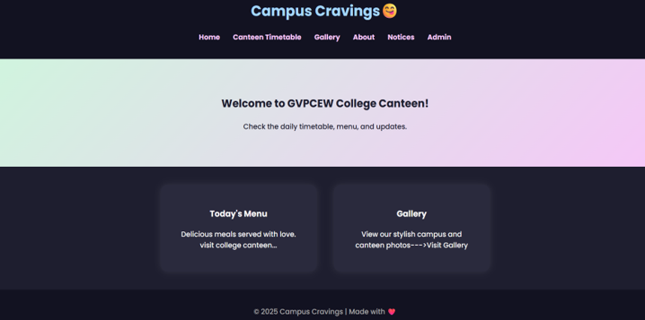
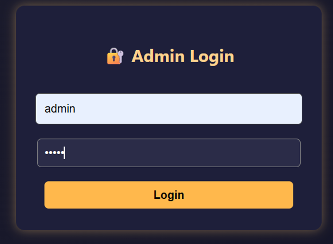
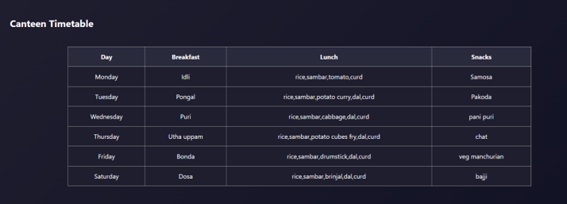
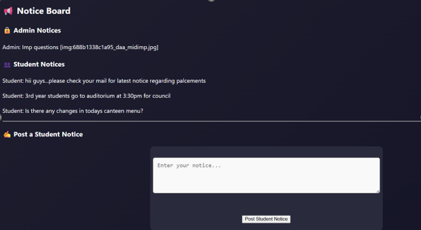

# 🎓 College Canteen & Notice Management System

A dynamic web-based management system designed to streamline canteen operations and digital notice board communication within a college environment. The system enables secure administrative control while providing students with real-time updates and announcements.

## 🎯 Project Objective

The objective of this project is to:

- Digitize the traditional college notice board
- Provide secure admin-controlled announcements
- Display and manage weekly canteen menus
- Improve transparency and communication between administration and students
- Offer a simple yet functional full-stack PHP web application

## 🏗️ System Architecture

- Frontend: HTML5, CSS3, JavaScript
- Backend: PHP
- Server: Apache (XAMPP)
- Data Storage: File-based storage (.txt files)
- Authentication: PHP Session Management

## 📂 Project Structure

college-canteen-notice-management-system/
│
├── index.html
├── admin_login.php
├── admin_panel.php
├── notice.php
├── gallery.html
├── canteen.html
├── style.css
├── data/
├── uploads/
├── screenshots/
    ├── home.png
    ├── admin-login.png
    ├── canteen-timetable.png
    └──notice-board.png
   

## ⚙️ How to Run Locally

1. Install XAMPP
2. Move project folder inside `htdocs`
3. Start Apache from XAMPP Control Panel
4. Open browser and visit:
   http://localhost/college-canteen-notice-management-system/

## 📸 Screenshots

### 🏠 Home Page

### 🔐 Admin Login

### 🛠️ Canteen Timetable

### 📢 Notice Board

## 🌟 Key Highlights

- Secure admin authentication system
- Image upload functionality for notices
- Editable canteen timetable
- Local storage integration (JavaScript)
- Structured folder architecture
- Responsive UI design
- Clean and maintainable codebase

## 💡 Technical Implementation Details

- Implemented session-based authentication for admin access.
- Used PHP file handling functions for persistent notice storage.
- Integrated image upload functionality using multipart form data.
- Utilized JavaScript localStorage for dynamic timetable updates.
- Structured modular folder architecture for maintainability.

## 👩‍💻 Developed By

Leela  Raja Rajeswari
B.Tech – 3rd Year Engineering Student  

## 📈 Future Improvements

- MySQL database integration
- Role-based authentication
- Notice filtering & search functionality
- Admin dashboard analytics
- Deployment on cloud hosting
